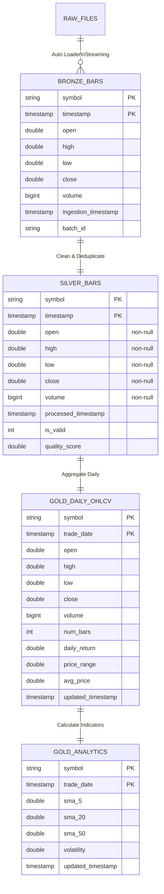
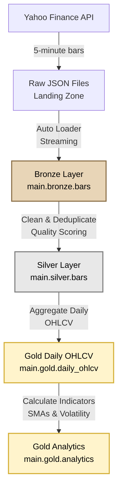

# Databricks Market Data POC

## Overview

This project is a **production-ready** data engineering pipeline that demonstrates how financial market data can be ingested from Yahoo Finance into Databricks using Apache Spark and Delta Lake. The pipeline showcases modern lakehouse design patterns, real-time streaming ingestion, and Spark-based analytical transformations using Databricks native technologies.

The project uses Yahoo Finance as the sole data source, which requires no API keys and makes the repository easily cloneable and usable by anyone without requiring authentication or secrets.

**Production Features**:
- Continuous streaming with Delta Live Tables (DLT)
- Real-time data processing
- Automatic file detection and schema evolution
- Built-in data quality expectations
- Auto-optimization and performance tuning
- Production-ready orchestration and monitoring

---

## Objectives

* Demonstrate ingestion of external REST API data into Databricks
* Apply a medallion (bronze / silver / gold) data architecture
* Use Delta Lake for reliable, repeatable data processing
* Showcase Spark transformations, window functions, and incremental loads
* Present clean, interview-ready code and documentation suitable for a portfolio project

---

## Architecture

The pipeline follows a standard Databricks lakehouse pattern with a medallion architecture (Bronze → Silver → Gold).

### Data Flow Diagram



### Pipeline Flow



### Bronze Layer (Raw Ingestion)

* Data is pulled from Yahoo Finance using the `yfinance` library
* Raw records are ingested with minimal transformation via **Auto Loader streaming**
* Metadata such as ingestion timestamp and batch_id are added
* Data is written append-only to Delta tables
* **Table**: `main.bronze.bars`
* **Key Fields**: `symbol`, `timestamp`, `batch_id` (composite key)

### Silver Layer (Cleaned & Normalized)

* Schema enforcement and type casting (all OHLCV fields non-nullable)
* Deduplication based on `symbol` and `timestamp` (keeps most recent)
* Data quality validation and scoring
* Standardized column names and data types
* Idempotent processing using Delta MERGE operations
* **Table**: `main.silver.bars`
* **Key Fields**: `symbol`, `timestamp` (composite key)
* **Quality Metrics**: `is_valid`, `quality_score`

### Gold Layer (Analytics & Aggregates)

#### Daily OHLCV Table
* Aggregates intraday 5-minute bars to daily OHLCV per symbol
* Calculates daily_return, price_range, avg_price
* **Table**: `main.gold.daily_ohlcv`
* **Key Fields**: `symbol`, `trade_date` (composite key)

#### Analytics Table
* Technical indicators: SMA 5, 20, 50-day moving averages
* Volatility calculation (stddev of returns)
* **Table**: `main.gold.analytics`
* **Key Fields**: `symbol`, `trade_date` (composite key)

---

## Technology Stack

### Databricks Native Technologies
* **Delta Live Tables (DLT)**: Declarative ETL framework for medallion architecture
* **Unity Catalog**: Modern data governance and catalog management
* **Auto Loader**: Automatic file detection and schema evolution for streaming
* **Delta Lake**: ACID transactions, time travel, and schema evolution
* **Databricks Workflows**: Orchestration and scheduling
* **Databricks Asset Bundles**: Infrastructure as code
* **Photon Engine**: High-performance query engine (optional)
* **Auto-optimization**: Automatic table optimization (Z-ordering, compaction)

### Core Technologies
* Python
* Apache Spark (Databricks Runtime)
* Delta Lake
* Structured Streaming
* **Yahoo Finance** (via `yfinance` library, free, no API keys required)
* Web scraping for symbol lists using `beautifulsoup4` (S&P 500 symbols from stockanalysis.com)
* Testing framework: `pytest` with comprehensive test coverage

---

## Project Structure

```
databricks-market-data-poc/
├── README.md
├── base_environment.yml        # Databricks serverless environment config
├── databricks.yml             # Databricks asset bundle configuration
├── requirements.txt           # Python package dependencies
├── LICENSE
├── notebooks/
│   ├── 00_setup.py            # Environment setup & initialization
│   ├── 01_collect_raw_data.py # Scheduled data collection job
│   ├── 02_ingest_bronze_bars.py  # Bronze layer ingestion
│   ├── 03_transform_silver_bars.py  # Silver layer transformation
│   ├── 04_gold_analytics.py   # Gold layer analytics
│   └── 05_data_quality_checks.py  # Data quality validation
├── src/
│   ├── data_sources/          # Data source clients
│   │   ├── __init__.py
│   │   ├── base_client.py     # Abstract base class for data sources
  │   │   └── yahoo_finance.py   # Yahoo Finance client using yfinance library
│   ├── config.py
│   ├── schemas.py
│   ├── transforms.py
│   └── utils.py
└── tests/
    ├── data_sources/
    │   └── test_yahoo_finance.py  # Unit tests for Yahoo Finance client
    └── test_utils.py              # Unit tests for utility functions (S&P 500 scraper)
```

### Notebooks - Detailed Breakdown

#### `00_setup.py` - Environment Setup & Initialization

**Purpose**: One-time setup to initialize the Databricks environment for the pipeline.

**Key Features**:
- **Dynamic Path Resolution**: Automatically detects project root across multiple environments (local Python, Databricks Repos, Workspace files)
- **Storage Mode Configuration**: Supports both Unity Catalog volumes and workspace file storage with automatic fallback
- **Spark Session Initialization**: Configures Spark with Delta Lake extensions for all downstream processing
- **Directory Creation**: Creates necessary storage directories for raw data landing zone and medallion layers
- **Schema Pre-creation**: Optionally pre-creates Delta table schemas for faster first ingestion

**Technical Highlights**:
- Multi-path detection algorithm handles various Databricks deployment scenarios
- Idempotent operations using `IF NOT EXISTS` clauses
- Error handling with clear fallback messages
- Configuration-driven storage selection (volumes vs workspace files)

**Skills Demonstrated**: Environment configuration, Databricks workspace management, Delta Lake setup, error handling

---

#### `01_collect_raw_data.py` - Scheduled Data Collection Job

**Purpose**: Production-ready scheduled job that collects market data from external APIs and writes to raw landing zone.

**Key Features**:
- **S&P 500 Symbol Discovery**: Web scraping with BeautifulSoup to extract 500+ stock symbols from stockanalysis.com
- **Holiday-Aware Date Logic**: Automatically determines last trading day, skipping weekends and all NYSE holidays (New Year's, MLK Day, Presidents' Day, Good Friday, Memorial Day, Juneteenth, Independence Day, Labor Day, Thanksgiving, Christmas)
- **Yahoo Finance Integration**: Uses `yfinance` library for reliable market data fetching with built-in rate limiting
- **Batch Processing**: Processes symbols in batches with configurable delays to respect API rate limits
- **Error Handling**: Comprehensive retry logic with exponential backoff for transient failures
- **Single Timestamped File**: Writes all symbols' data to a single JSON file per date (`bars_YYYYMMDD.json`) for efficient Spark processing
- **Idempotent Design**: Can be safely re-run without creating duplicates

**Technical Highlights**:
- **Holiday Calculation**: Implements Gregorian algorithm for Easter/Good Friday calculation
- **Rate Limiting**: Configurable delays between API calls with automatic retry on 429 errors
- **Progress Reporting**: Real-time progress updates during data collection
- **Storage Abstraction**: Works with both Unity Catalog volumes and workspace files
- **Spark Session Management**: Initializes Spark only when needed for file operations

**Data Flow**:
```
External APIs (Yahoo Finance) 
  → Python data collection 
  → JSON serialization 
  → Databricks Volume/Workspace storage
  → Single timestamped file per trading day
```

**Skills Demonstrated**: Web scraping, API integration, rate limiting, error handling, production scheduling, data serialization, Spark file operations

---

#### `02_ingest_bronze_bars.py` - Bronze Layer Ingestion

**Purpose**: Reads raw JSON files from landing zone and ingests into Bronze Delta tables with schema enforcement.

**Key Features**:
- **Spark JSON Reader**: Uses Spark's native JSON reader for efficient processing of large files (handles files of any size)
- **Schema Enforcement**: Applies explicit Bronze schema with proper data types (timestamp, double, bigint)
- **Metadata Addition**: Automatically adds ingestion metadata (ingestion_timestamp, batch_id)
- **Idempotent MERGE**: Uses Delta Lake MERGE operations to prevent duplicates on re-runs
- **Automatic Date Detection**: Finds most recent date directory or accepts date parameter
- **Fallback Handling**: Falls back to Python JSON parsing if Spark reader fails (for edge cases)

**Technical Highlights**:
- **Delta MERGE Pattern**: Implements production-grade idempotent upsert logic
  ```sql
  MERGE INTO bronze_table AS target
  USING new_data AS source
  ON target.symbol = source.symbol 
     AND target.timestamp = source.timestamp
     AND target.batch_id = source.batch_id
  WHEN MATCHED THEN UPDATE SET *
  WHEN NOT MATCHED THEN INSERT *
  ```
- **Type Casting**: Ensures proper data type conversion (strings to timestamps, numbers to doubles)
- **Catalog Management**: Automatically creates Unity Catalog schemas if they don't exist
- **Data Validation**: Verifies data loaded before proceeding to transformations

**Data Flow**:
```
Raw JSON files (landing zone)
  → Spark JSON reader
  → Schema validation & type casting
  → Metadata enrichment
  → Delta MERGE operation
  → Bronze Delta table
```

**Skills Demonstrated**: Delta Lake operations, Spark DataFrame operations, schema management, idempotent processing, data validation

---

#### `03_transform_silver_bars.py` - Silver Layer Transformation

**Purpose**: Transforms Bronze raw data into cleaned, normalized Silver layer with data quality improvements.

**Key Features**:
- **Schema Enforcement**: Applies strict Silver schema with non-nullable fields
- **Deduplication**: Removes duplicate records based on symbol + timestamp composite key
- **Data Cleaning**: 
  - Handles missing values appropriately
  - Validates price ranges (positive values, reasonable ranges)
  - Standardizes data formats
- **Type Casting**: Ensures all columns match Silver schema exactly
- **Quality Flags**: Adds data quality indicators (is_valid, quality_score)
- **Idempotent MERGE**: Uses Delta MERGE for safe re-processing

**Technical Highlights**:
- Window functions for deduplication
- Data quality scoring algorithms
- Null handling strategies
- Outlier detection

**Skills Demonstrated**: Data cleaning, deduplication strategies, data quality frameworks, Spark transformations

---

#### `04_gold_analytics.py` - Gold Layer Analytics

**Purpose**: Creates analytics-ready aggregated datasets with technical indicators for downstream consumption.

**Key Features**:
- **Daily OHLCV Aggregation**: Aggregates intraday 5-minute bars to daily OHLCV per symbol
- **Technical Indicators**: 
  - Simple Moving Averages (5-day, 20-day, 50-day)
  - Daily returns calculation
  - Price range and volatility metrics
- **Optimized Schema**: Denormalized structure optimized for querying and visualization
- **Incremental Updates**: Only processes new data since last run

**Technical Highlights**:
- Spark window functions for moving averages
- Time-series aggregations
- Performance optimization for analytics queries

**Skills Demonstrated**: Time-series analytics, Spark aggregations, window functions, analytical data modeling

---

#### `05_data_quality_checks.py` - Data Quality Validation

**Purpose**: Validates data quality across all medallion layers and generates quality reports.

**Key Features**:
- **Null Value Checks**: Validates required fields are not null
- **Range Validation**: Checks price ranges, volume ranges, timestamp ranges
- **Completeness Checks**: Verifies expected row counts per symbol/date
- **Consistency Checks**: Validates relationships between fields (e.g., high >= low, high >= close)
- **Quality Reporting**: Generates summary reports with pass/fail indicators

**Technical Highlights**:
- Comprehensive validation framework
- Automated quality scoring
- Alert generation for quality issues

**Skills Demonstrated**: Data quality frameworks, validation strategies, monitoring and alerting

### Source Code

* `data_sources/`
  Data source client implementation:
  * `base_client.py`: Abstract base class defining the interface for data sources
  * `yahoo_finance.py`: Yahoo Finance client using `yfinance` library with retry logic and error handling

* `schemas.py`
  Explicit Spark schemas used across ingestion and transformation layers

* `transforms.py`
  Reusable Spark transformation logic

* `utils.py`
  Utility functions including S&P 500 symbol scraper (`get_sp500_symbols()`), logging, date/time handling, and common operations

---

## Production-Ready Features

### Data Collection (`01_collect_raw_data.py`)
* **Holiday-Aware Scheduling**: Automatically skips weekends and all NYSE holidays when determining trading days
* **Robust Error Handling**: Comprehensive retry logic with exponential backoff for API failures
* **Rate Limiting**: Configurable delays between API calls to respect provider limits
* **Progress Tracking**: Real-time progress reporting during data collection
* **Idempotent Operations**: Can be safely re-run without creating duplicates
* **Storage Flexibility**: Supports both Unity Catalog volumes and workspace file storage

### Bronze Ingestion (`02_ingest_bronze_bars.py`)
* **Schema Enforcement**: Explicit Spark schemas ensure data quality at ingestion
* **Delta MERGE Operations**: Idempotent upsert pattern prevents duplicates
* **Metadata Tracking**: Automatic addition of ingestion metadata for lineage
* **Large File Handling**: Uses Spark's native JSON reader (no size limits)
* **Type Safety**: Proper type casting and validation before writing to Delta

### Architecture Patterns
* **Medallion Architecture**: Clear separation between raw (Bronze), cleaned (Silver), and analytics (Gold) layers
* **Separation of Concerns**: Data collection separated from processing for better scalability
* **Configuration-Driven**: All paths and settings configurable via `src/config.py`
* **Extensible Design**: Base client interface allows easy addition of new data sources
* **Production Scheduling**: Designed to run as scheduled Databricks jobs

### Code Quality
* **Type Hints**: Strict typing throughout (Python type hints, Spark schemas)
* **Comprehensive Testing**: Unit tests with pytest for all utility functions
* **Documentation**: Google-style docstrings with examples
* **Error Messages**: Clear, actionable error messages for debugging
* **Modular Design**: Functions designed for testability and reusability

---

## Data Quality & Reliability

The pipeline includes comprehensive quality checks:

* Non-null constraints on key fields (symbol, timestamp, close)
* Deduplication guarantees at the silver layer
* Data quality scoring and validation at each layer
* Row count and timestamp range validation
* Idempotent re-runs using Delta Lake semantics
* Cross-layer consistency validation

---

## Security & Configuration

* API keys are not hardcoded
* Credentials are expected to be provided via environment variables or notebook-scoped configuration
* No secrets are committed to the repository
* **No API keys required**: The project uses Yahoo Finance which is free and requires no authentication

---

## How to Run

### Local Development

1. **Clone the repository:**
   ```bash
   git clone https://github.com/Cole-Dylewski/databricks-market-data-poc.git
   cd databricks-market-data-poc
   ```

2. **Install dependencies:**
   ```bash
   pip install -r requirements.txt
   ```

3. **Run comprehensive test suite:**
   ```bash
   python run_tests.py
   ```
   This runs all validation checks including syntax, imports, tests, coverage, and code quality.
   See `TEST_RUNNER.md` for detailed information.

4. **Run tests manually:**
   ```bash
   pytest tests/ -v --cov=src --cov-report=html
   ```

5. **Run linting:**
   ```bash
   flake8 src/ tests/
   black --check src/ tests/
   ```

### Databricks Setup

1. **Import the project into a Databricks workspace:**
   - Use Databricks Repos to connect the repository (recommended), or
   - Manually upload the notebooks and source files

2. **Configure environment:**
   - For **serverless notebooks**: 
     - Upload `base_environment.yml` to Databricks workspace
     - Go to Settings → Workspace admin → Compute
     - Click "Manage" next to "Base environments for serverless compute"
     - Create new environment and upload `base_environment.yml`
     - Set as default if desired
   - For **cluster-based notebooks**: 
     - Install packages from `requirements.txt` in your Databricks cluster
     - Note: PySpark and Delta Lake are typically pre-installed in Databricks

3. **Data source configuration:**
   - The project uses Yahoo Finance by default, which requires no API keys
   - See `src/config.py` for rate limiting and retry configuration options

4. **Run notebooks in order:**
   1. `00_setup.py` - Environment setup (run once)
   2. `01_collect_raw_data.py` - Collect market data (scheduled daily)
   3. `02_ingest_bronze_bars.py` - Ingest to Bronze layer
   4. `03_transform_silver_bars.py` - Transform to Silver layer
   5. `04_gold_analytics.py` - Create Gold analytics
   6. `05_data_quality_checks.py` - Validate data quality

5. **Deploy with Databricks Asset Bundles**:
   ```bash
   # Deploy DLT pipeline and workflows
   databricks bundle deploy
   ```
   
   Or configure manually in Databricks Workflows UI:
   - Create jobs with dependencies between pipeline steps
   - Schedule collection job to run daily after market close
   - Configure alerts and retry policies

6. **Explore Examples and Documentation**:
   - **SQL Queries**: `examples/example_queries.sql` - 10+ analytics use cases
   - **Dashboard Queries**: `examples/dashboard_queries.sql` - Visualization-ready queries
   - **Performance Guide**: `docs/PERFORMANCE.md` - Optimization strategies
   - **Monitoring Guide**: `docs/MONITORING.md` - DLT and job monitoring
   - **Troubleshooting**: `docs/TROUBLESHOOTING.md` - Common issues and solutions
   - **Logging Guide**: `docs/LOGGING.md` - Structured logging best practices

---

## Technical Skills Demonstrated

This project showcases proficiency in:

### Data Engineering
- **ETL/ELT Pipeline Design**: End-to-end data pipeline from collection to analytics
- **Medallion Architecture**: Bronze (raw) → Silver (cleaned) → Gold (analytics) pattern
- **Incremental Processing**: Idempotent operations for reliable data updates
- **Schema Management**: Explicit schemas with type enforcement at each layer

### Databricks & Spark
- **Delta Live Tables (DLT)**: Declarative ETL with automatic dependency management
- **Delta Lake**: MERGE operations, schema evolution, time travel, auto-optimization
- **Auto Loader**: Automatic file detection and streaming ingestion
- **Unity Catalog**: Modern data governance and catalog management
- **Structured Streaming**: Real-time data processing with exactly-once semantics
- **Databricks Workflows**: Production-ready job orchestration and scheduling
- **Databricks Asset Bundles**: Infrastructure as code for deployments
- **Photon Engine**: High-performance query acceleration (optional)
- **Auto-optimization**: Automatic Z-ordering and compaction

### Python Development
- **Type Safety**: Strict type hints throughout codebase
- **Error Handling**: Comprehensive exception handling with retry logic
- **Testing**: Unit tests with pytest and mocking
- **Code Organization**: Modular design with clear separation of concerns

### API Integration & Web Scraping
- **REST API Integration**: Yahoo Finance API with rate limiting
- **Web Scraping**: BeautifulSoup for symbol discovery
- **Holiday Logic**: Complex date calculations (Easter, trading holidays)
- **Retry Patterns**: Exponential backoff for transient failures

### Production Engineering
- **Idempotency**: Safe re-runs without side effects
- **Configuration Management**: Environment-aware configuration
- **Error Recovery**: Graceful degradation and fallback mechanisms
- **Monitoring**: Progress tracking and quality validation

---

## Intended Audience

This project is designed for:

* Hiring managers evaluating data engineering candidates
* Interview discussions around Databricks, Spark, and lakehouse design
* Demonstrating architectural thinking and clean implementation practices
* Portfolio showcase of production-ready data engineering skills

The pipeline is production-ready and can be deployed to Databricks workspaces for real-time market data processing and analytics.

---

## Pipeline Components

### Data Collection Pipeline
* Yahoo Finance integration using `yfinance` library
* S&P 500 symbol scraper with comprehensive test coverage
* Holiday-aware trading day calculation (all NYSE holidays)
* Rate limiting and retry logic with exponential backoff
* Single timestamped JSON file per date for efficient processing

### Bronze Layer Ingestion
* Spark-based streaming ingestion with Auto Loader
* Explicit schema enforcement with proper data types
* Delta Lake MERGE operations for idempotent processing
* Metadata enrichment (ingestion_timestamp, batch_id)
* Unity Catalog and workspace file storage support

### Silver Layer Transformations
* Schema enforcement and type casting
* Deduplication (keeps most recent by ingestion_timestamp)
* Data quality validation (price relationships, volume checks)
* Quality scoring algorithm (completeness, consistency, reasonableness)
* Valid/invalid record flagging
* Incremental processing support
* Idempotent Delta MERGE operations

### Gold Layer Analytics
* Daily OHLCV aggregation from intraday bars
* Calculated metrics (daily_return, price_range, avg_price)
* Technical indicators (SMA 5, 20, 50-day moving averages)
* Volatility calculation (stddev of returns over 20-day window)
* Incremental processing with window function recalculation
* Idempotent Delta MERGE operations

### Data Quality Checks Framework
* Bronze layer validation (nulls, ranges, completeness)
* Silver layer quality metrics (quality scores, validity checks)
* Gold layer consistency checks (indicator completeness, relationships)
* Cross-layer consistency validation (symbol and date range checks)
* Comprehensive quality reporting

### Transformation Functions (`src/transforms.py`)
* `clean_bronze_to_silver()`: Complete Bronze to Silver transformation
* `aggregate_to_daily_ohlcv()`: Daily aggregation with metrics
* `calculate_technical_indicators()`: Technical indicator calculations
* Helper functions for incremental processing

---

## License

This project is licensed under the MIT License.
